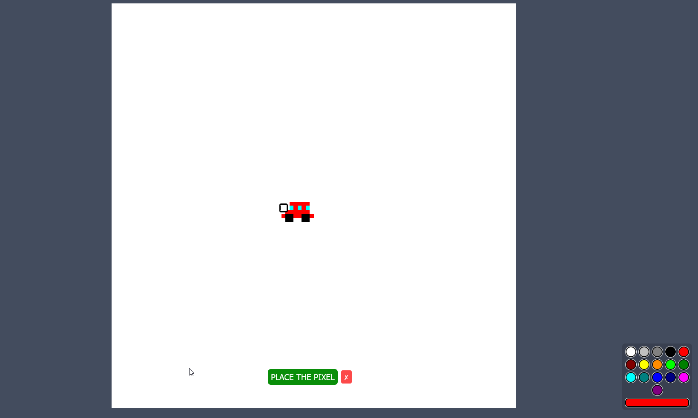

# 2D Place

[](https://opensource.org/licenses/MIT)
[](https://github.com/kaidalisohaib/2d-place)


A real-time, collaborative pixel art canvas inspired by r/place, built with a high-performance Rust backend and a reactive SvelteKit frontend.

---

### **Visual Demo**



---

## Table of Contents

- [2D Place](#2d-place)
    - [**Visual Demo**](#visual-demo)
  - [Table of Contents](#table-of-contents)
  - [About The Project](#about-the-project)
  - [Key Features](#key-features)
  - [Tech Stack](#tech-stack)
  - [Architecture \& Design](#architecture--design)
  - [Getting Started](#getting-started)
    - [Prerequisites](#prerequisites)
    - [Installation](#installation)
  - [Usage](#usage)
  - [Technical Challenges \& Lessons Learned](#technical-challenges--lessons-learned)
    - [1. Efficient Real-Time State Synchronization](#1-efficient-real-time-state-synchronization)
    - [2. Cross-Language Type-Safe Communication](#2-cross-language-type-safe-communication)
  - [Future Improvements](#future-improvements)
  - [License](#license)

## About The Project

This project is a full-stack implementation of a collaborative canvas, similar to Reddit's popular r/place experiment. The goal was to build a highly performant, real-time application from scratch, focusing on efficient client-server communication and modern web technologies.

Users can connect to a shared canvas, select a color, and place individual pixels. These changes are broadcast to all connected clients instantly, creating a dynamic and interactive experience. The application leverages a powerful combination of a Rust backend for its safety and speed, and a SvelteKit frontend for its reactive and intuitive UI development.

## Key Features

-   **Real-Time Collaborative Canvas:** See other users' pixel placements appear on your screen instantly without a refresh.
-   **Interactive UI:** Smoothly pan and zoom the canvas using mouse controls to navigate the pixel grid.
-   **Efficient Binary Communication:** Utilizes WebSockets with the **Bebop** binary serialization format for extremely low-latency and minimal network overhead compared to JSON.
-   **State Synchronization:** New clients receive the full canvas state, followed by lightweight "delta" updates for subsequent changes.
-   **Color Palette:** A simple and intuitive color picker allows users to select from a predefined set of colors.

## Tech Stack

This project is built with a modern and performance-oriented tech stack.

| Category                | Technologies                                                                      |
| ----------------------- | --------------------------------------------------------------------------------- |
| **Backend**             | Rust, Tokio, `tokio-tungstenite` (WebSockets)                                     |
| **Frontend**            | SvelteKit, TypeScript, Vite, HTML5 Canvas                                         |
| **Data Serialization**  | Bebop (Schema-driven binary serialization)                                        |
| **Build & Tooling**     | Cargo (Rust), PNPM (Node.js)                                                      |

## Architecture & Design

The application follows a classic client-server architecture, designed for high concurrency and real-time performance.

-   **Backend (Rust):**
    -   Built on the Tokio asynchronous runtime, the backend manages WebSocket connections and the shared canvas state.
    -   The central grid `State` is protected by an `Arc<RwLock>` to ensure safe concurrent access from multiple client connections.
    -   Tokio channels (`broadcast` and `mpsc`) are used to decouple connection handling from state manipulation logic, creating a robust and scalable design. A dedicated task listens for incoming pixel placements, updates the state, and broadcasts the change to all clients.
-   **Frontend (SvelteKit):**
    -   A modern Single-Page Application (SPA) that provides the user interface.
    -   The grid is rendered using the **HTML5 Canvas API**, which is highly efficient for drawing large numbers of pixels.
    -   All client-side interactions, such as panning, zooming, and clicking, are managed within Svelte components.
-   **Communication Protocol (Bebop):**
    -   The core of the real-time communication is the Bebop serialization format. A single schema file (`grid.bop`) defines the data structures (like `Pixel`, `Grid`, `DeltaGrid`) used by both the server and client.
    -   This schema is used to auto-generate type-safe code for both Rust and TypeScript, eliminating bugs and providing significant performance gains over text-based formats like JSON.

## Getting Started

Follow these instructions to get a local copy up and running.

### Prerequisites

-   [Rust & Cargo](https://www.rust-lang.org/tools/install)
-   [Node.js](https://nodejs.org/) (v16+) and PNPM (`npm install -g pnpm`)

### Installation

1.  **Clone the repository:**
    ```sh
    git clone https://github.com/kaidalisohaib/2d-place.git
    cd 2d-place
    ```
2.  **Setup the Backend:**
    ```sh
    cd backend
    cargo run
    ```
    The server will start on `127.0.0.1:8080`.
3.  **Setup the Frontend (in a new terminal):**
    ```sh
    cd frontend
    pnpm install
    pnpm run compile-bebop  # This step is crucial! It generates the TS code from the schema.
    pnpm run dev
    ```
    The application will be available at `http://localhost:5173`.

## Usage

Once both the backend and frontend are running, open your browser to the frontend URL. You should see the canvas load. You can then:
-   **Pan:** Click and drag the mouse to move the canvas around.
-   **Zoom:** Use the mouse wheel to zoom in and out.
--   **Place a Pixel:** Click anywhere on the grid to select a pixel, choose a color from the color picker, and click the "PLACE THE PIXEL" button.

## Technical Challenges & Lessons Learned

This section highlights key technical problems encountered during development and the solutions implemented.

### 1. Efficient Real-Time State Synchronization

-   **The Problem:** Keeping hundreds of clients in sync with the canvas state is challenging. Sending the entire 100x100 grid for every single pixel change would be incredibly inefficient and lead to high latency.
-   **The Solution:** I implemented a dual-message strategy. When a new client connects, they receive the full grid state once. After that, the server only broadcasts small "delta" updates (`DeltaGrid`) containing only the pixels that have actually changed. This dramatically reduces the size of each message. A background task on the server periodically merges these deltas into the main grid state, ensuring new clients always get an up-to-date board.
-   **What I Learned:** This taught me the importance of designing state synchronization protocols that minimize data transfer. It was a practical application of asynchronous tasks in Rust for handling periodic background jobs and managing a stateful application efficiently.

### 2. Cross-Language Type-Safe Communication

-   **The Problem:** Ensuring that the data structures sent by the Rust backend perfectly match what the TypeScript frontend expects is critical. Using JSON can lead to subtle runtime errors, serialization overhead, and manual type definition drift.
-   **The Solution:** I adopted the **Bebop** binary serialization framework. By defining a single, language-agnostic schema in a `.bop` file, I could automatically generate type-safe serialization and deserialization code for both Rust (via `build.rs`) and TypeScript (via an `npm script`). This approach guarantees that the client and server are always in sync and provides a massive performance boost due to its compact binary format.
-   **What I Learned:** This project demonstrated the power of schema-driven development for building robust and performant client-server applications. I gained valuable hands-on experience with binary serialization, build-time code generation, and creating a reliable communication contract between different programming languages.

## Future Improvements

-   [ ] **User Authentication & Rate Limiting:** Implement user accounts to track contributions and add a cooldown timer to prevent pixel spam.
-   [ ] **Database Integration:** Persist the grid state in a database like PostgreSQL or Redis so that the canvas survives server restarts.
-   [ ] **Expandable Canvas:** Introduce functionality for an administrator to dynamically resize the canvas.
-   [ ] **Containerization:** Add `Dockerfile`s for the frontend and backend to enable easy, reproducible deployments with Docker Compose.

## License

Distributed under the MIT License. See the `LICENSE` file for more information.